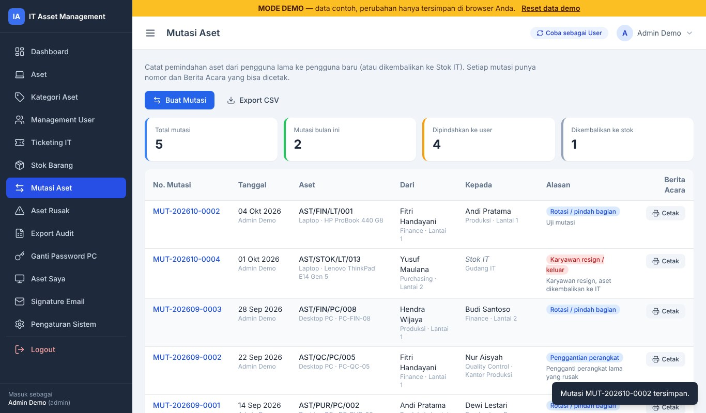
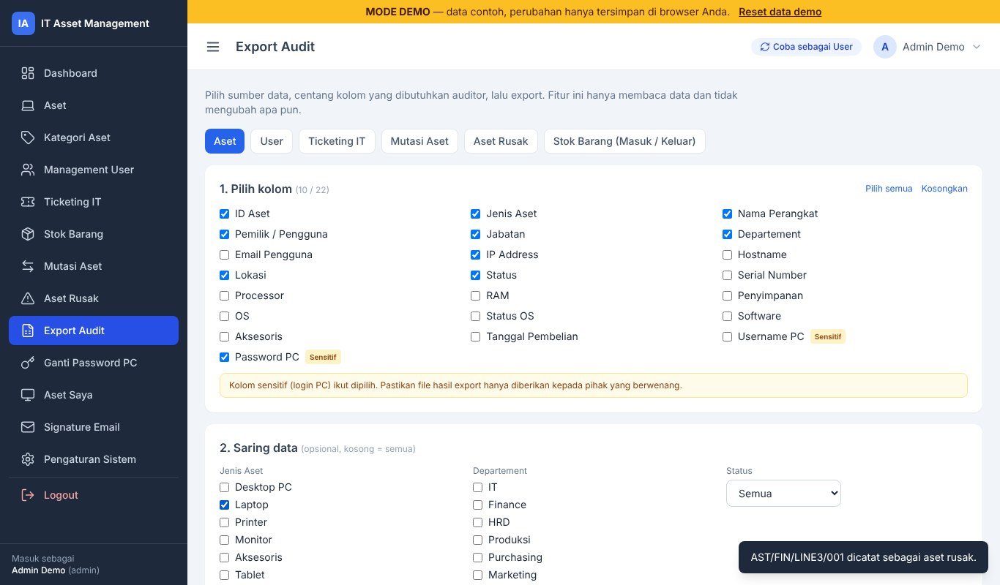
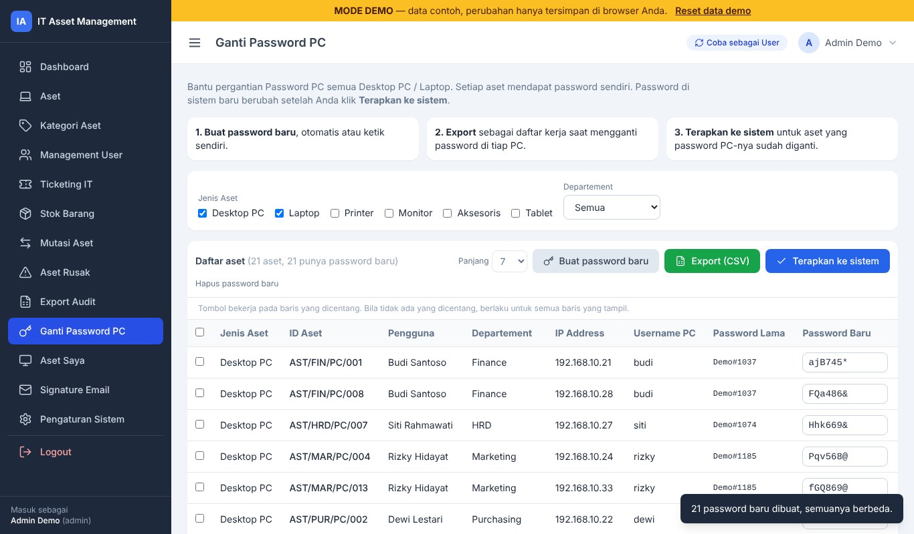
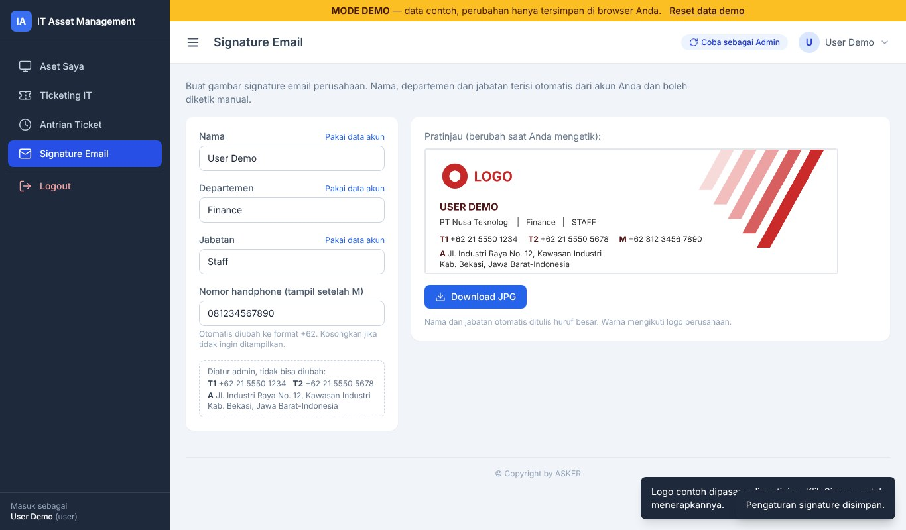
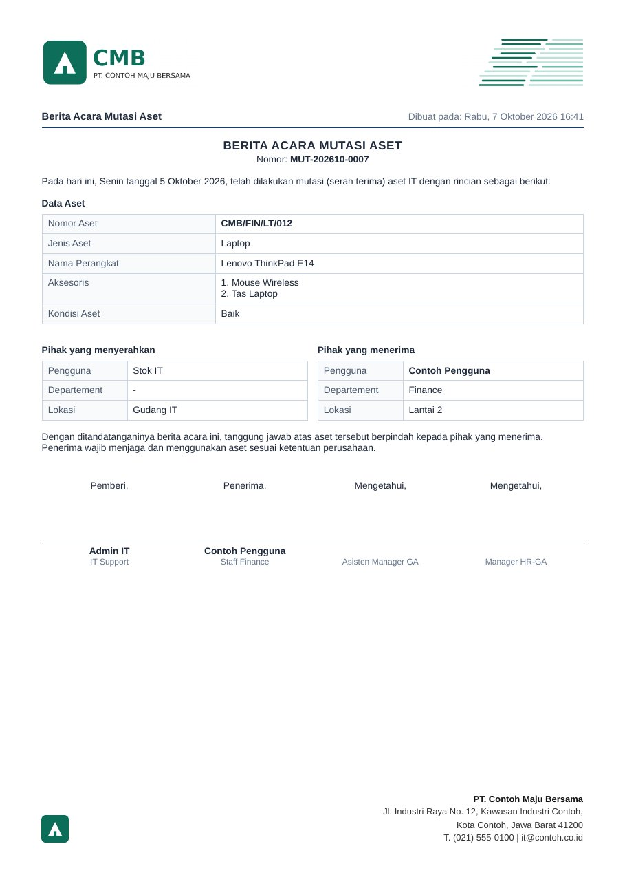

# IT Asset Management

**Aplikasi web inventaris aset IT, ticketing helpdesk, dan stok barang untuk tim IT perusahaan.**

🔗 **Live demo:** <https://reksa-yp.github.io/it-asset-management-demo/>

⬇️ **Unduh aplikasi (open source, lisensi MIT):** <https://reksa-yp.github.io/it-asset-management-demo/unduh.html>
— atau langsung file ZIP-nya: [`download/asker-it-asset.zip`](download/asker-it-asset.zip) (PHP + MySQL, siap dipasang di XAMPP).

📘 **Panduan penggunaan (PDF, 25 halaman):** [`download/Panduan-Penggunaan-ASKER-IT-Asset.pdf`](download/Panduan-Penggunaan-ASKER-IT-Asset.pdf) — fungsi setiap menu dan cara menggunakannya. File ini juga ada di dalam ZIP.

> Demo ini berjalan 100% di browser dengan **data contoh fiktif**. Silakan tambah, ubah, atau hapus data —
> perubahan hanya tersimpan di browser Anda dan bisa dikembalikan lewat tombol **Reset data demo**.

---

## Coba Langsung

| Peran | Username | Password |
|---|---|---|
| Admin | `admin` | `admin123` |
| User  | `user`  | `user123`  |

Atau klik **Masuk sebagai Admin / User** di halaman login. Tombol **Coba sebagai User/Admin** di kanan atas
memudahkan berpindah peran — misalnya buat tiket sebagai User, lalu proses tiketnya sebagai Admin.

## Fitur Utama

**Admin**
- **Dashboard** — total aset, antrian tiket, grafik aset per jenis, peringatan aset yang *harus upgrade* dan stok menipis.
  Kartu **Perbaikan Selesai Hari Ini** bisa diklik untuk melihat tiket mana saja yang diselesaikan hari ini.
- **Aset** — pencarian & filter, banyak software per aset, isian khusus Tablet, detail & cetak.
  🆕 **Nomor aset dibuat otomatis saat Simpan** (`PREFIX/DEPT/JENIS/001`), tetap bisa diubah saat edit.
  🆕 **Aksesoris diisi per baris** (Nama + Brand/Type). 🆕 Kolom **Jabatan** mengikuti data user.
- **Import Aset + User sekaligus** — satu template Excel: satu baris = satu aset beserta penggunanya.
- **Kategori Aset** yang bisa dikustomisasi.
- **Management User** — departement, role, data login PC. 🆕 Isian **Jabatan** dan tombol **Generate Password PC**
  (pola 3 huruf + angka + simbol, contoh `kMa249$`).
- **Ticketing IT** — status Menunggu → Proses → Selesai, rincian pengerjaan & hasil pengecekan.
  🆕 Daftar tiket menampilkan **tanggal selesai, lama pengerjaan, dan Riwayat Update** (siapa mengubah status dan kapan).
- **Stok Barang** — barang masuk/keluar, rekap per kategori & per user, stok aset IT otomatis, serah terima ke user.
- 🆕 **Mutasi Aset** — pemindahan aset antar pengguna atau kembali ke stok, lengkap dengan **Berita Acara** siap cetak.
  Serah terima dari menu Stok juga tercatat di sini.
- 🆕 **Aset Rusak** — daftar aset rusak, lokasi penyimpanan, dan status perbaikannya.
- 🆕 **Export Audit** — pilih sendiri sumber data dan kolom yang diminta auditor, saring per jenis aset/departement, lalu export.
- 🆕 **Ganti Password PC** — membuat password baru yang **berbeda untuk tiap aset**, daftar kerja untuk di-export,
  lalu **Terapkan ke sistem**.
- **Pengaturan Sistem** — nama sistem, logo, dan prefix nomor aset.
- 🆕 **Kop Surat** — logo, ornamen, nama, dan alamat perusahaan diatur admin, lalu dicetak di **setiap halaman** dokumen
  (Print dan PDF) serta di bagian atas file Excel. Zona waktu untuk tulisan "Dibuat pada" bisa dipilih (WIB/WITA/WIT).
- 🆕 **Scan QR aset** — QR pada label berisi alamat detail aset, bisa dipindai dengan kamera HP atau scanner USB.
  Tombol Scan QR ada di Dashboard dan menu Aset.
- 🆕 **File Excel seragam** — semua export dan template import memuat logo, judul otomatis (mis. *Data Desktop PC dan Laptop*),
  tanggal dibuat, jumlah data, dan kolom **No**. Judul kolom di baris 8; import mengenali susunan baru maupun file lama.
- 🆕 **Filter Lokasi** di daftar aset, dan **tombol VNC** di samping IP aset untuk membuka TightVNC Viewer dari PC admin.

**User**
- **Aset Saya** — detail perangkat, riwayat perbaikan, dan riwayat upgrade.
- **Buat & batalkan tiket**, serta **Antrian Ticket** untuk melihat posisi tiket.

**Admin & User** 🆕
- **Signature Email** — membuat gambar signature email (JPG). Nama, departemen, dan jabatan terisi otomatis;
  logo, telepon, dan alamat perusahaan diatur admin, dan **warna signature otomatis mengikuti warna logo**.
- **Menu akun di ikon user (pojok kanan atas)** — menampilkan jabatan, departement, email, dan **Ganti Password** login.

## Teknologi

| Aplikasi asli | Versi demo (repo ini) |
|---|---|
| PHP 8 (native, PDO) · MySQL / MariaDB | HTML + JavaScript (tanpa server) |
| TailwindCSS · PhpSpreadsheet (Excel) · Dompdf (PDF) | TailwindCSS · data di `localStorage` |
| Installer web, multi-bahasa (ID/EN), RBAC admin/user | Di-hosting gratis di GitHub Pages |

Fitur yang hanya ada di aplikasi asli: export Excel/PDF lengkap, kop surat dokumen, scan QR aset, filter lokasi, tombol VNC,
backup database otomatis, installer web.
(Import Aset + User di demo memakai SheetJS dari CDN, jadi perlu koneksi internet.)

## Screenshot

| Mutasi Aset | Export Audit |
|---|---|
|  |  |

| Ganti Password PC | Signature Email |
|---|---|
|  |  |

| Dokumen berkop (aplikasi asli) |
|---|
|  |

Tangkapan layar lain ada di folder `screenshots/`.

---

## Setup GitHub Pages (tanpa install apa pun)

1. Login di <https://github.com> → tombol **+** → **New repository**.
   - Repository name: `it-asset-management-demo`
   - Pilih **Public** → **Create repository**
2. Klik **uploading an existing file**, lalu seret **isi** folder demo ini
   (`index.html`, folder `assets`, folder `screenshots`, `README.md`) → **Commit changes**.
3. **Settings** → **Pages** → Source: **Deploy from a branch** → Branch **main**, folder **/ (root)** → **Save**.
4. Tunggu 1–2 menit. Alamat demo: `https://USERNAME-GITHUB-ANDA.github.io/it-asset-management-demo/`
5. Edit `README.md` ini di GitHub (ikon pensil) dan ganti alamat **Live demo** di bagian atas.
6. Di halaman utama repo, klik ⚙️ di samping **About** → centang **Use your GitHub Pages website**,
   supaya link demo tampil di bagian atas repo.

**Mengubah data contoh:** edit `assets/js/data.js`, lalu naikkan angka `version` supaya pengunjung
lama otomatis mendapat data baru.

---

© Copyright by ASKER
